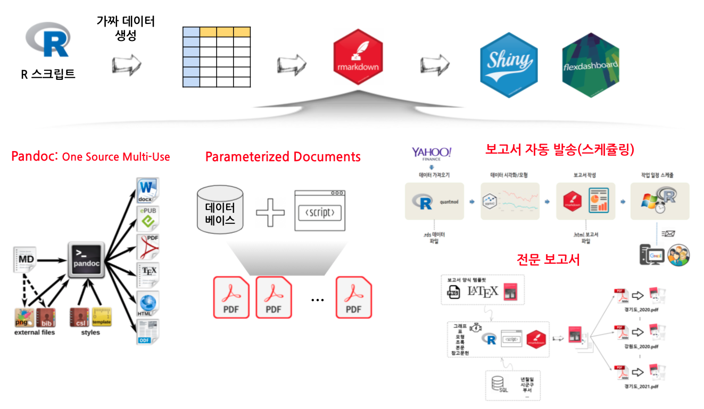

# 문서는 커뮤니케이션이다.

[한국 R 컨퍼런스](https://use-r.kr/) "결국 문서는 커뮤니케이션이다." 발표자료에 사용되는 코드를 모아두었습니다.

# 누가 고객인가

문서를 소비하는 고객은 그때 그때 다르다.

# 문서 공학

커뮤니케이션을 위한 목적이 다르기 때문에 다양한 문서 공학 기법이 동원된다.

# One-Source Multi-Use

R Markdown 에서 Word, HTML, PDF 파일을 뽑아낸다.

# Parameterized Document

동일한 형태의 보고서를 매개변수(Parameter)만 달리하여 보고서를 찍어낸다.

# 전자우편 문서

`blastula` 팩키지를 사용해서 전자우편 본문 내용 뿐만 아니라 전자우편을 표준화시켜 발송시킨다.

# 웹앱 대쉬보드

`shiny`, `flexdashboard` 등 웹앱 제작 도구를 사용해서 웹의 장점을 극대화시킨 문서를 제작한다.

